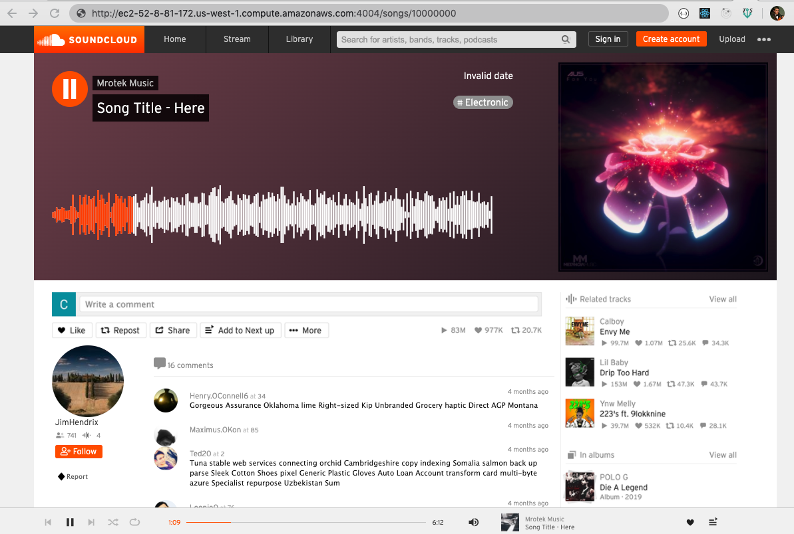
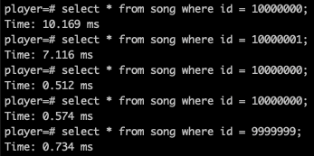
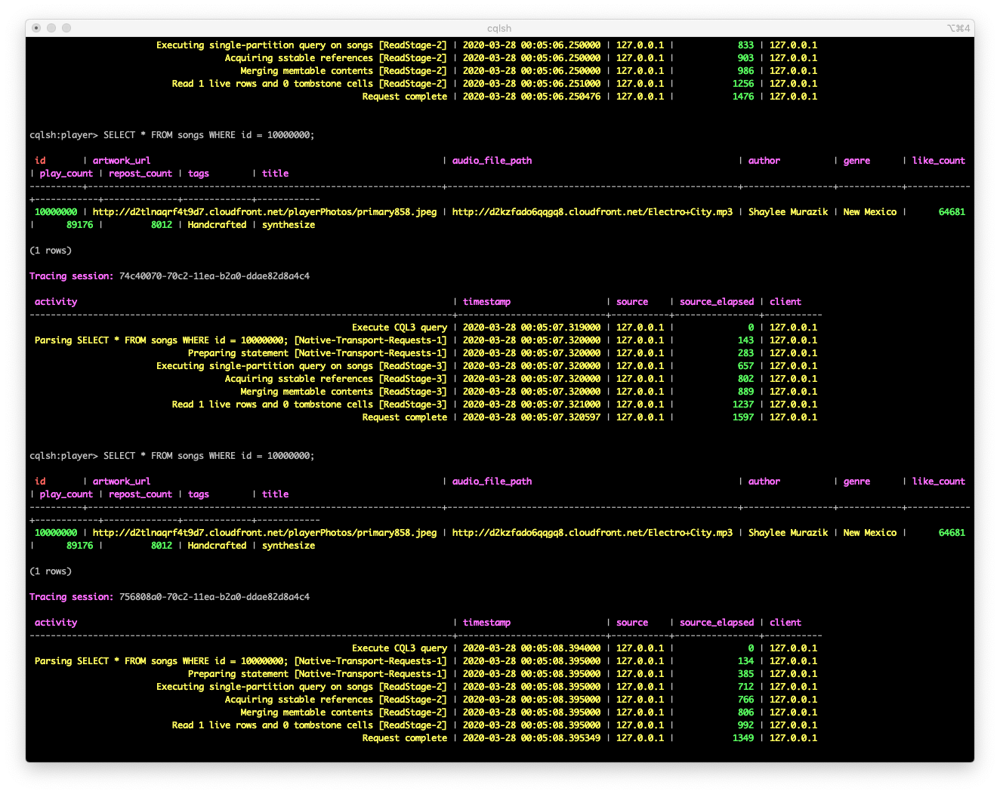
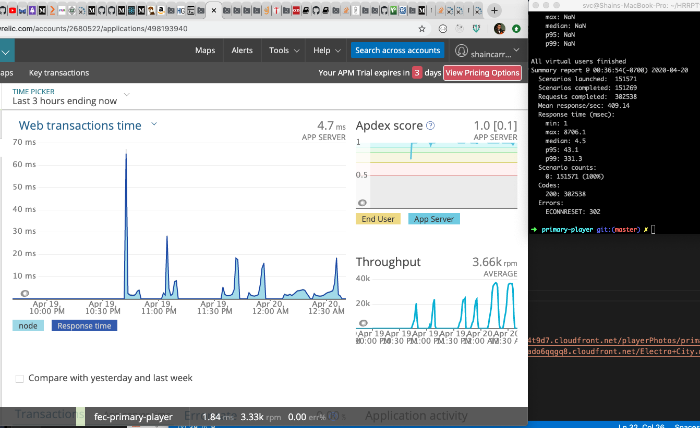
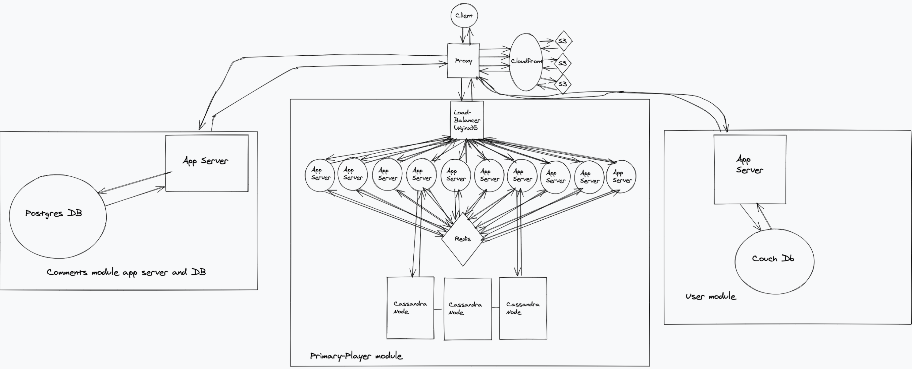
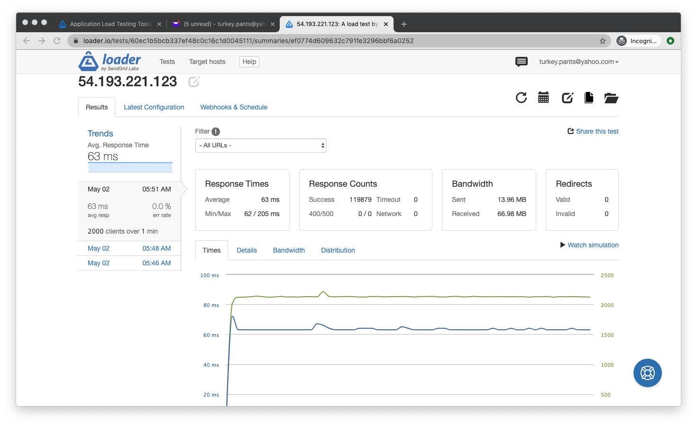
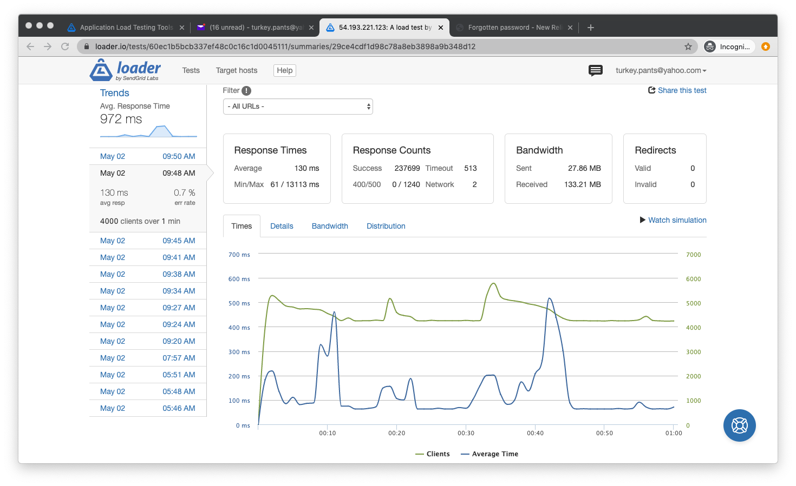

# AudioStorm is an Audio distrubution and music sharing website, and is a clone of the popular website Soundcloud.

This primary-player module is one of three microservices which are coordinated by a proxy server to form the application AudioStorm.

    • Created visually and functionally identical microservices as Soundcloud's with an Agile style team of engineers. I built the user microservice, and optimized the back end for the primary-player microservice.
    • Each microservice has its own database (originally MongoDB)and webserver for delivering that module's content to the user
    • Organized code reviews with team members to create proper API endpoints for successful communication between microservices
    • Streamlined deployment of static assets to AWS S3 using Grunt
    • Improved front end loading speed by optimizing images using kraken.io, minifying bundle.js using webpack, and using AWS CloudFront CDN to deliver static assets from AWS S3.
    • Increased the database to hold 10M unique records, and tested query speeds for PostgreSQL and Cassandra

    • Although PostgreSQL was faster, I chose Cassandra because of its resiliency - given the structure of Cassandra in deployment (data sharded, replicated, and distributed across 3 nodes)
    • Locally stress tested microservice and proxy using Artillery.io and newRelic to ramp up RPS from 1 to 1000.

    • Deployed to AWS EC2s and horizontally scaled using Nginx load balancer, 15 app servers, Redis caching, and 3 Cassandra nodes - optimizing throughput

    • Stress tested deployment using loader.io, determining throughput to be 3800 RPS with < 1% error rate

# primary-player:
"scripts": {
    "test": "jest",
    "serve": "nodemon --inspect server/index.js",
    "build-sass": "node-sass -w client/src/css -o client/dist",
    "build-react": "webpack --watch",
    "seed": "node ./database/seed.js"

# Important -- This app uses environment variables, which are defined in a .env file. The .env files are not saved to the repo for security reasons. Anytime this app is deployed to a new environment, the environment variables have to be accounted for, in this case, as connection uri to connect to the database, also which port the server is running on is defined in the .env file.

# Seed the database:
npm run seed

# Start the server:
npm run serve

# Run tests:
npm run test

# If the front end gets adjusted, we'll need to rebuild with webpack:
npm run build-react

# If css somehow gets tweaked, may need to rebuild sass:
npm run build-sass

# CRUD API endpoints:
Create: app.post('/songs', songController.addSong);
Read: one song data - app.get('/songs/:id', songController.getSong);
      all song data - app.get('/songs', songController.getSongs);
Update: app.put('/songs/:id', songController.updateSong);
Delete: app.delete('/songs/:id', songController.deleteSong);

Before horizontal scaling - Single app server and 3 node Cassandra cluster could handle 2500 RPS with < 1% error rate and an average response time of 224ms.